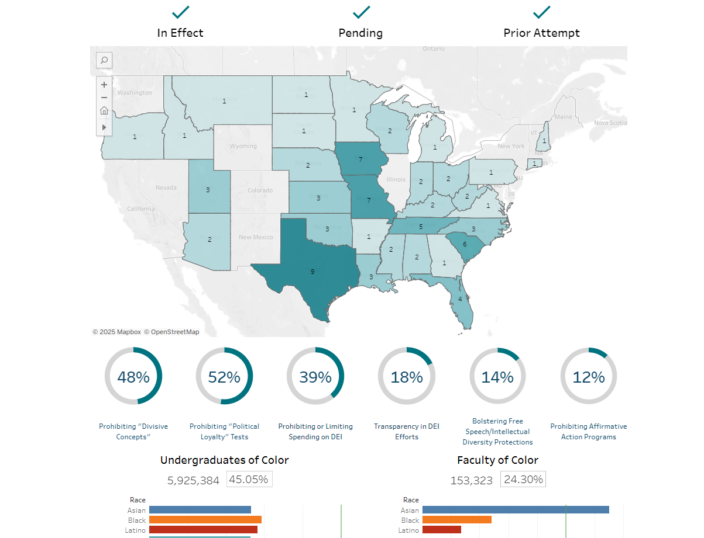
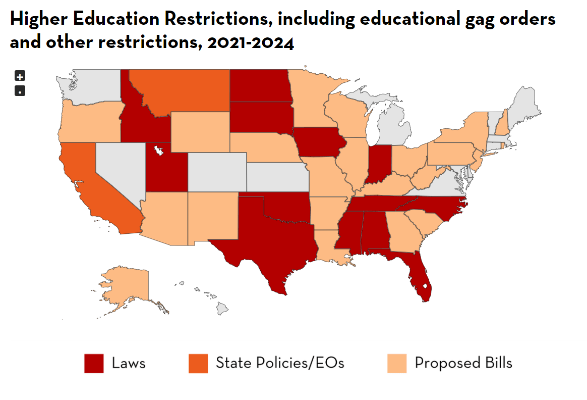
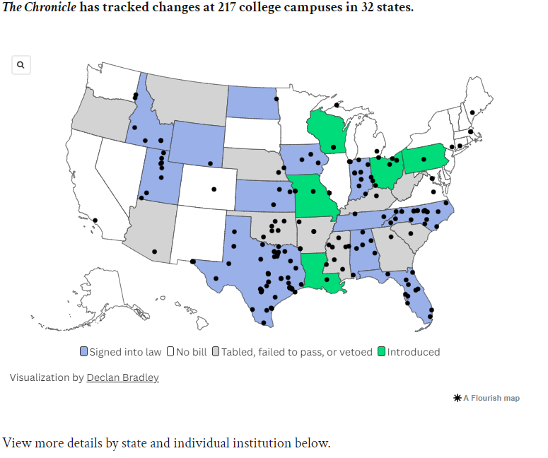
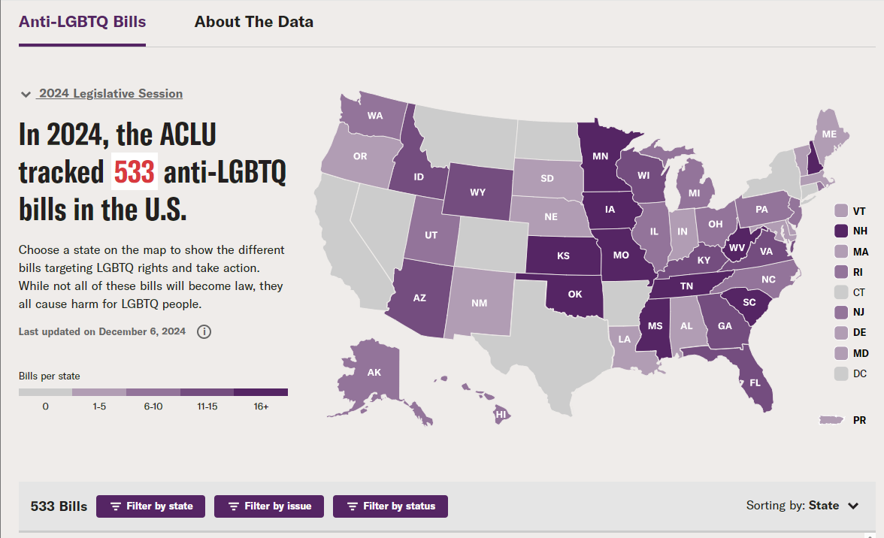

---
tags:
    - Teaching
    - Diversity, Equity, Inclusion
    - Call to Action
    - Resources
---

*[DEI]: Diversity, Equity, Inclusion
*[LGBTQ]: Lesbian, Gay, Bi-sexual, Trans, Queer/Questioning

# Attacks on DEI, Censorship, & Higher Education

!!! info "Content Limitation"

    This page is incomplete and only reflects English, US-based resources at the moment. Please [contribute! :material-open-in-new:](https://studentwiki.github.io/contribute/)

=== "Legislation Maps :map:"

    ## **Legislation Maps**

    | Name | Description | Screenshot | Link |
    |---|---|---|---|
    | EdTrust: Map of Anti-DEI Efforts on College Campuses Across the U.S. | Use our interactive dashboard to keep track of the evolving attacks on DEI across the states. |  | [**Anti-DEI Efforts Across the U.S.** :material-open-in-new:](https://edtrust.org/rti/a-map-of-anti-dei-efforts-on-college-campuses-across-the-u-s/) |
    | PEN: America's Censored Classrooms 2024 | In this report, we analyze the educational censorship laws introduced and passed in the now mostly concluded 2024 legislative sessions, with a particular focus on higher education. |  | [**America's Censored Classrooms 2024 Report** :material-open-in-new:](https://pen.org/report/americas-censored-classrooms-2024/) |
    | The Chronicle of Higher Education: Tracking Higher Ed’s Dismantling of DEI | This tracker collects changes that public colleges have made to offices, jobs, training, diversity statements, and other DEI-related activities as the result of bills, executive orders, system mandates, and other state-level actions since January 2023. |  | [**Tracking Higher Ed’s Dismantling of DEI** :material-open-in-new:](https://www.chronicle.com/article/tracking-higher-eds-dismantling-of-dei) |
    | ACLU: Anti-LGBTQ Bills | Choose a state on the map to show the different bills targeting LGBTQ rights and take action. While not all of these bills will become law, they all cause harm for LGBTQ people. |  | [**Anti-LGBTQ Bills** :material-open-in-new:](https://www.aclu.org/legislative-attacks-on-lgbtq-rights-2024) |

=== "Resources"

    ## **Resources**

    ### [**PEN: Educational Censorship** :material-open-in-new:](https://pen.org/educational-censorship/)

    {==

    PEN America’s signature campaign against educational gag orders — and other legislative restrictions on the freedom to learn and teach that have swept the country since January 2021 — defends students and faculty against legislative infringements on free expression on campus and in the classroom. [Learn More :octicons-arrow-right-24:](https://pen.org/educational-censorship/)

    ==}

    

    - :material-table-large: Map, Index of Gag Orders
    - :fontawesome-solid-people-carry-box: Meet Champions
    - :fontawesome-solid-toolbox: Resource Guides, Tipsheet
    - :fontawesome-solid-newspaper: Blog

    

    ___

    ### [**AAC&U: Government Overreach** :material-open-in-new:](https://www.aacu.org/trending-topics/government-overreach)

    {==

    Increasingly, government intervention in higher education is constraining the freedom of inquiry and expression essential to liberal education and violating the principles of academic freedom and institutional autonomy. [Learn More :octicons-arrow-right-24:](https://www.aacu.org/trending-topics/government-overreach)

    ==}

    

    - :material-table-large: Trackers, Maps
    - :material-library-outline: Public Statements, Reports
    - :octicons-video-16: Webinars
    - :fontawesome-solid-newspaper: Featured Media

    

    ___

    ### [**EdTrust: Anti-DEI Efforts Across the U.S.** :material-open-in-new:](https://edtrust.org/search/#type=data-tool+digital-report+report&topic=education-equity)

    {==

    EdTrust is committed to advancing policies and practices to dismantle the racial and economic barriers embedded in the American education system. Through our research and advocacy, EdTrust improves equity in education from preschool through college, engages diverse communities dedicated to education equity and justice, and increases political and public will to build an education system where students will thrive. [Learn More :octicons-arrow-right-24:](https://edtrust.org/search/#type=data-tool+digital-report+report&topic=education-equity)

    ==}

    

    - :material-table-large: Database of resources, Data Tool
    - :fontawesome-solid-toolbox: Fact Sheets, Infographics, Guides
    - :material-library-outline: Briefs, Reports, Public Comments/Testimony
    - :fontawesome-solid-newspaper: State news, Blog, Op-Ed, Press Releases
    - :octicons-video-16: Video, Podcast

    

    ___

    ### [**The Chronicle of Higher Education: The Dismantling of DEI** :material-open-in-new:](https://www.chronicle.com/package/the-assault-on-dei)

    {==

    Republican politicians in early 2023 launched an assault on colleges’ diversity, equity, and inclusion efforts to recruit and retain faculty and students of color. While college administrators say their so-called DEI efforts are an effective strategy to repair decades of exclusionary policies and practices that repelled communities of color from their campuses, Republican leaders say the practices violate free speech, break antidiscrimination laws, and are a misuse of public money. _Note: May require login._ [Learn More :octicons-arrow-right-24:](https://www.chronicle.com/package/the-assault-on-dei)

    ==}

    

    - :material-table-large: Tracker, Maps
    - :octicons-video-16: Video Explanation
    - :fontawesome-solid-newspaper: Recent Stories

    

    ___

    ### [**Higher Ed Equity Network: Diversity Equity Inclusion Navigator** :material-open-in-new:](https://navigator.higheredequitynetwork.org/)

    {==

    The Higher Ed Equity Network brings together more than 25 organizations at the forefront of driving change in higher education to collaborate on creating equitable systems that embrace the full potential and value of Black, Latino/a/x, Indigenous, and other students who are harmed by persistent systemic barriers linked to their racial and ethnic identities. [Learn More :octicons-arrow-right-24:](https://navigator.higheredequitynetwork.org/)

    ==}

    

    - :material-table-large: Tracker, Map
    - :fontawesome-solid-toolbox: Anti-DEI Impacts, Resources to Dispel Myths
    - :fontawesome-solid-people-carry-box: Connect with Fellow Educators

    

___