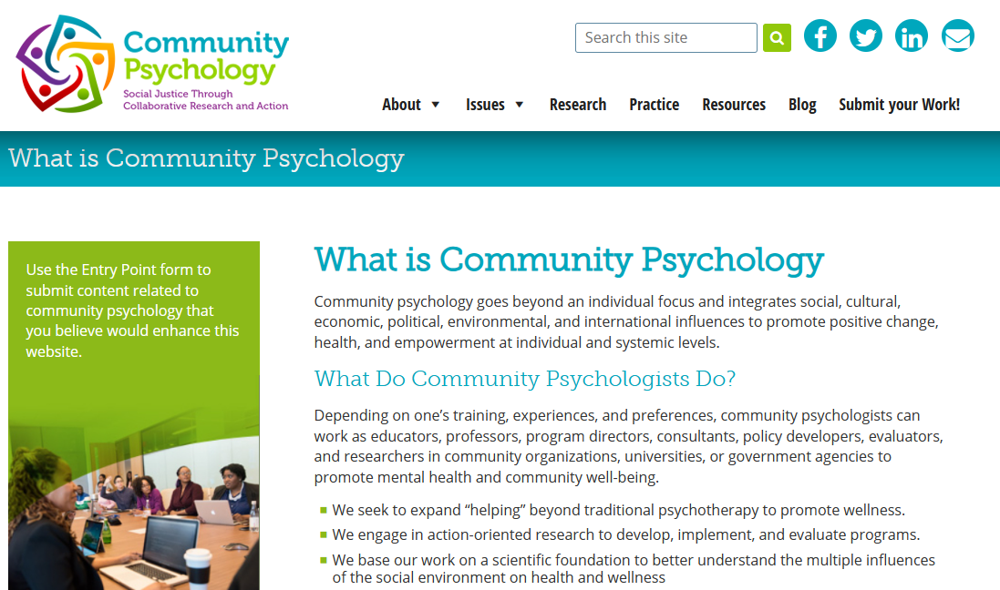
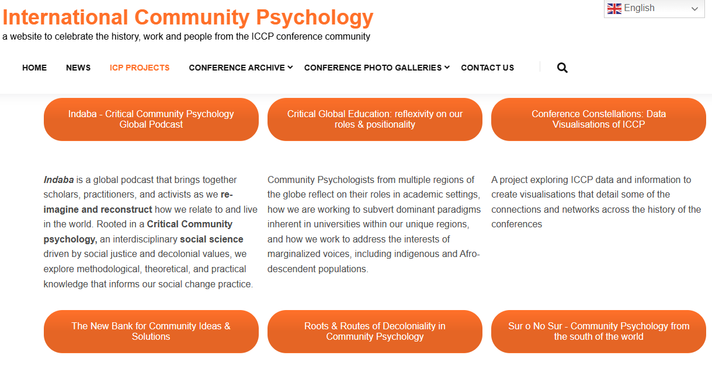
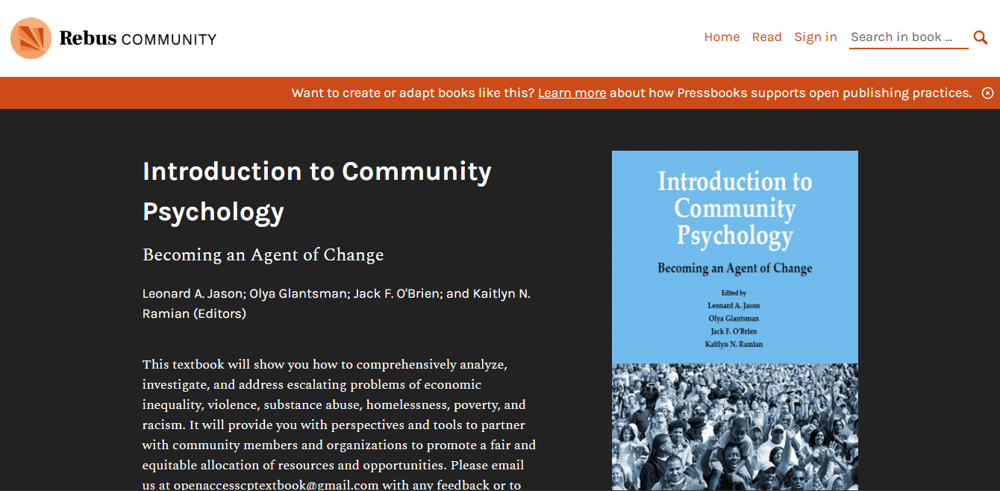
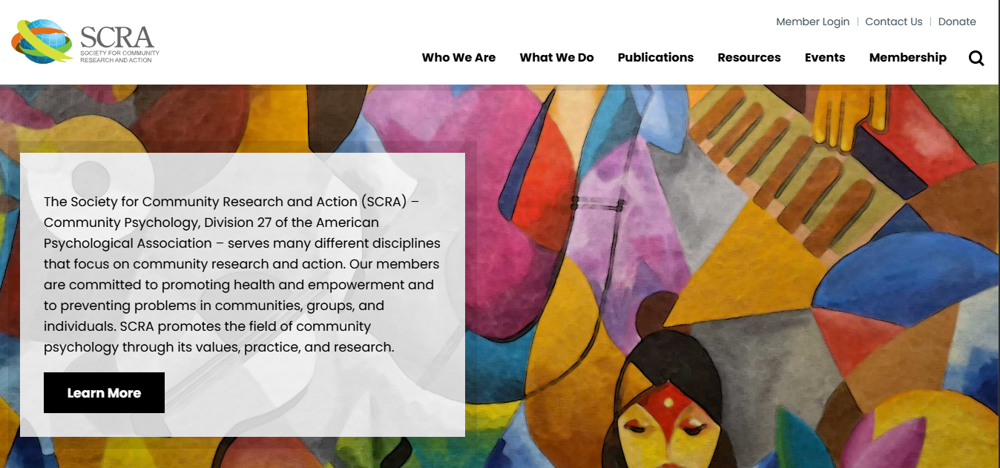
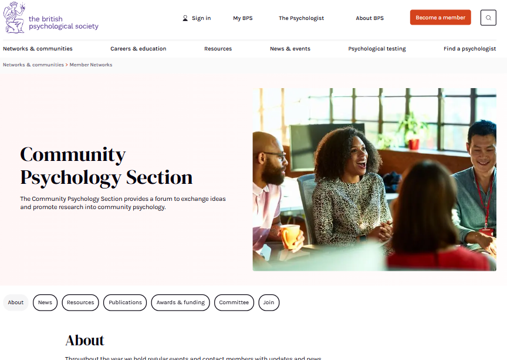

# Welcome Community Psychology Students!

{==

## What is Community Psychology?

*Community Psychologists consider how community intersects with the well-being of people.*

==}

=== "Approaches to the Field"

    ## Approaches to the Field

    ### _The study or application of:_

    

    - **the well-being of communities**
        - [x] empowerment
        - [x] activism, organising
        - [x] social justice
    - **what people understand about their own well-being** & **the well-being of their communities**
        - [x] participatory & community-based action research
        - [x] cultural humility
    - **how communities shape the well-being of people** <--> **how people shape the well-being of communities**
        - [x] ecological models
        - [x] relationships
        - [x] healing
    - **how people define and relate to their communities**
        - [x] diversity
        - [x] inclusion
        - [x] equity
        - [x] marginalization
    

=== "Common Concepts"

    ## Common Concepts in the Field

    (*Click on concepts to learn more - links will open external sources in a new tab :material-open-in-new:*)

    - [psicología de la liberación](https://www.researchgate.net/publication/279852723_La_Psicologia_de_la_Liberacion_25_anos_despues_de_Martin-Baro_memoria_y_desafios_actuales) / [liberation psychology](https://libpsy.org/welcome/defining-liberation-psychology/)
    - [decolonization](https://psychiatryonline.org/doi/10.1176/appi.ajp-rj.2021.160406) / [descolonización](https://semanariouniversidad.com/suplementos/frantz-fanon-de-la-descolonizacion-al-pensamiento-critico/)
    - [pedagogy of the oppressed](https://envs.ucsc.edu/internships/internship-readings/freire-pedagogy-of-the-oppressed.pdf) / [pedagogia do oprimido](https://iconografiadahistoria.com.br/2021/09/19/pedagogia-do-oprimido-a-educacao-como-pratica-libertadora/)
    - [intersectionality](https://psycnet.apa.org/fulltext/2020-98089-002.html) (& Black feminist theories)
    - [social & feminist models of disability](https://plato.stanford.edu/entries/feminism-disability/)
    - [transnational feminism](https://www.tandfonline.com/doi/pdf/10.1080/02703149.2020.1774997)
    - [critical race theories](https://neurodiversity.engr.uconn.edu/wp-content/uploads/sites/3154/2022/06/Dis-ability-critical-race-studies-DisCrit-theorizing-at-the-intersections-of-race-and-dis-ability.pdf)
    - [arts-based](https://libguides.uml.edu/ABR), [solidarity](https://solidarityresearch.org/about/), & [participatory](https://actionresearch.mit.edu/what-par) methodologies
    - [Indigenous epistemologies](https://opentextbc.ca/indigenizationcurriculumdevelopers/chapter/indigenous-epistemologies-and-pedagogies/)
    - [social constructivism](https://gsi.berkeley.edu/gsi-guide-contents/learning-theory-research/social-constructivism/)
    - [ecological systems models](https://socialsci.libretexts.org/Courses/Pasadena_City_College/Child_Developmental_Psychology_-_Topical_Approach/02%3A_Theoretical_Perspectives_in_Development/2.11%3A_Bronfenbrenner_and_Ecological_Systems)
    - [praxis](https://sk.sagepub.com/reference/curriculumstudies/n90.xml)
    - [reflexivity](https://open.oregonstate.education/qualresearchmethods/chapter/ch-6-reflexivity/)

=== "Quick Links to Learn More"

    ## Quick links to learn more

    

    **[CommunityPsychology.com :material-open-in-new:](https://www.communitypsychology.com/what-is-community-psychology/)**  
    Read more at the Society for Community Research and Action (SCRA)'s informational website.

    

    

    ___

    

    **[InternationalCommunityPsychology.com :material-open-in-new:](https://internationalcommunitypsychology.com/projects/)**  
    Check out the projects of International Community Psychologists (ICP), including a podcast, youtube channel, and website of resources.
    
    

    

    ___

    

    ***[Introduction to Community Psychology: Becoming an Agent of Change :material-open-in-new:](https://press.rebus.community/introductiontocommunitypsychology/)***  
    Access a free, online book introducing the field by Leonard A. Jason; Olya Glantsman; Jack F. O'Brien; and Kaitlyn N. Ramian (Editors).
    
    

    

    ___

    

    **[scra27.org :material-open-in-new:](https://scra27.org/)**  
    Get updates on conferences, job postings, and networking opportunities with other students and professionals of community psychology in SCRA (Division 27).
    
    

    

    ___

    

    **[The British Psychological Society - Community Psychology Section :material-open-in-new:](https://www.bps.org.uk/member-networks/community-psychology-section)**  
    The Community Psychology section of the British Psychological Society has an interactive page on the field and history of community psychology.
    
    

    

{==

## Can I contribute content to this wiki?

**Yes!** Check out our [**contribution page** :material-open-in-new:](https://studentwiki.github.io/contribute/) to learn how!

==}

___